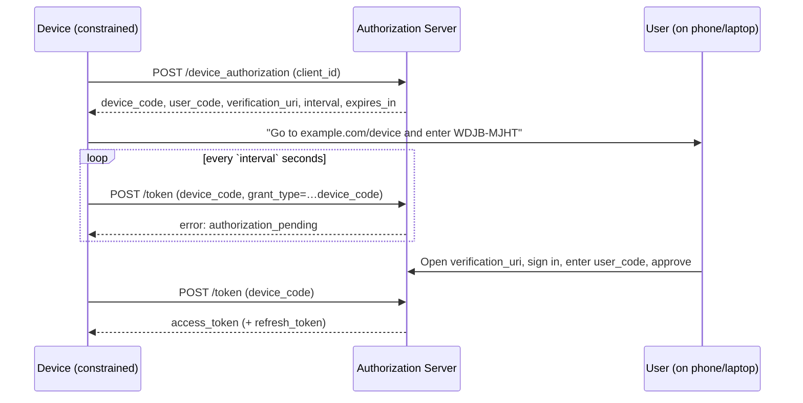

> **TL;DR** — The device authorization grant ([RFC 8628](https://www.rfc-editor.org/rfc/rfc8628)) solves a narrow problem: how does a device with no browser and an awful input method (a TV, a CLI, a thermostat) get an access token? It moves the consent step to a second device the user *does* control, and has the input-constrained device poll for the result. The mechanics are simple. The security is not — almost everything that can go wrong is a failure to bind *this human's approval* to *that specific device*.

## The problem: authorization assumes a browser

The OAuth 2.0 authorization code flow assumes the thing being authorized can open a browser, follow redirects, and accept a callback on a loopback or registered URI. That assumption holds for web apps and mobile apps. It falls apart the moment the client is **input-constrained**: a smart TV with a D-pad, a CLI logging into a cloud provider, an IoT device with no screen at all.

You can't reasonably ask someone to type a password — let alone complete an MFA challenge — by clicking letters one at a time with a remote. And you definitely don't want the TV *handling* the password. So the device flow does something deliberately indirect: it keeps the credentials off the constrained device entirely and borrows a better-equipped one (your phone, your laptop) to do the actual authorizing.

## The flow

The device makes an unauthenticated request to a **device authorization endpoint** and gets back two codes and a URL:

- `device_code` — an opaque, high-entropy handle the device keeps to itself.
- `user_code` — a short, human-typeable string (e.g. `WDJB-MJHT`) shown on the device's screen.
- `verification_uri` — where the human goes to approve (e.g. `https://example.com/device`).
- `verification_uri_complete` *(optional)* — the same URL with the `user_code` pre-filled, suitable for a QR code.
- `expires_in` and `interval` — how long the codes live, and how often the device may poll.

The human opens `verification_uri` on a *different* device, signs in normally, enters the `user_code`, and approves. Meanwhile the constrained device polls the **token endpoint** with its `device_code` until the human finishes.

Two channels, one binding: the **device** holds the `device_code`, the **human** approves the `user_code`, and the authorization server is responsible for stitching the two together so the token lands on the device that started the flow — and *only* that device.

## Polling: the part everyone gets subtly wrong

The token endpoint is a state machine, and the device has to respect its answers. Per the spec, the relevant token-endpoint errors are:

- `authorization_pending` — the user hasn't finished yet. Keep polling, **at the same interval**.
- `slow_down` — you're polling too fast. Increase your interval by **5 seconds** and continue.
- `access_denied` — the user said no. Stop.
- `expired_token` — the `device_code` aged out before approval. Stop and restart the flow.

The two mistakes I see most often:

1. **Ignoring `interval` and `slow_down`.** A tight poll loop gets you rate-limited, and a naive client treats the `slow_down` as a hard error instead of backing off. The contract is explicit: start at `interval`, and add 5s every time you're told to slow down.
2. **Treating `authorization_pending` as failure.** It's the *normal* state for most of the flow. Only `access_denied`, `expired_token`, and transport errors are terminal.

A correct poll loop is small but has to honor all four signals — pending and slow_down mean *continue*, denied and expired mean *stop*.

## Why this is an authorization story, not a UX story

It's tempting to file the device flow under "login UX for TVs." But the interesting part is structural. You're **delegating authority to a principal that can't authenticate the user itself**, and the entire security of the scheme reduces to one question:

> Did *this specific human's* approval get bound to *this specific device's* request — and nothing else?

Everything that goes wrong is a violation of that binding. Which brings us to the tradeoffs.

### `user_code` entropy vs. typeability

The `user_code` is short on purpose — a human has to read it off a screen and type it on another device. But short means low-entropy, and low-entropy means **brute-forceable**: an attacker who can guess valid `user_code`s can try to hijack pending authorizations. RFC 8628 is blunt about this (§5.1): the server must rate-limit and account for the reduced entropy. The design tension is real — make the code friendlier to type and you make it friendlier to guess.

### Device code phishing

This is the flow's signature attack, and it falls straight out of the two-channel design. An attacker starts a *legitimate* device flow against the real authorization server, gets a real `user_code`, and then social-engineers a victim into approving it — "enter this code to verify your account." The victim authenticates against the genuine server, sees a genuine consent screen, approves… and the **token lands on the attacker's device.** Nothing was spoofed; the human's approval was simply bound to the wrong device.

`verification_uri_complete` (the QR-code convenience that pre-fills the code) sharpens this: it removes the one friction step — manually typing the code — that might have made the victim pause. Convenience and phishing-resistance are pulling in opposite directions here.

Mitigations are all about tightening the binding and shrinking the window:
- **Short `expires_in`.** A code that lives two minutes is a far smaller phishing window than one that lives fifteen.
- **Meaningful consent.** The approval screen should say *what* is being authorized and, where possible, surface device/context so the human can notice "wait, I'm not setting up a TV right now."
- **Context limits.** High-value flows can require the approving device to share a network with the requesting one, or otherwise prove proximity.

### Short-lived, narrowly-scoped tokens

The same principle that makes this flow defensible is the one I keep coming back to across everything I write here: **issue the least authority, for the shortest time, bound as tightly to the request as you can.** A device token that is broadly scoped and long-lived turns a single successful phish into durable, wide access. A token scoped to exactly what the device needs, with a refresh token you can revoke, contains the blast radius when — not if — one of these bindings fails.

## The takeaway

The device authorization grant is a small, well-specified flow, and it's easy to implement the happy path in an afternoon. The discipline is in the parts that aren't about getting a token: respecting the poll contract, keeping the `user_code` window small and rate-limited, writing a consent screen that helps a human catch a phish, and scoping the resulting token down to the minimum. The flow doesn't authenticate the user *to the device* — it borrows a second device to do it, and then trusts the server to bind the two. Get that binding right, keep the authority small, and it's a clean solution to a genuinely awkward problem.
