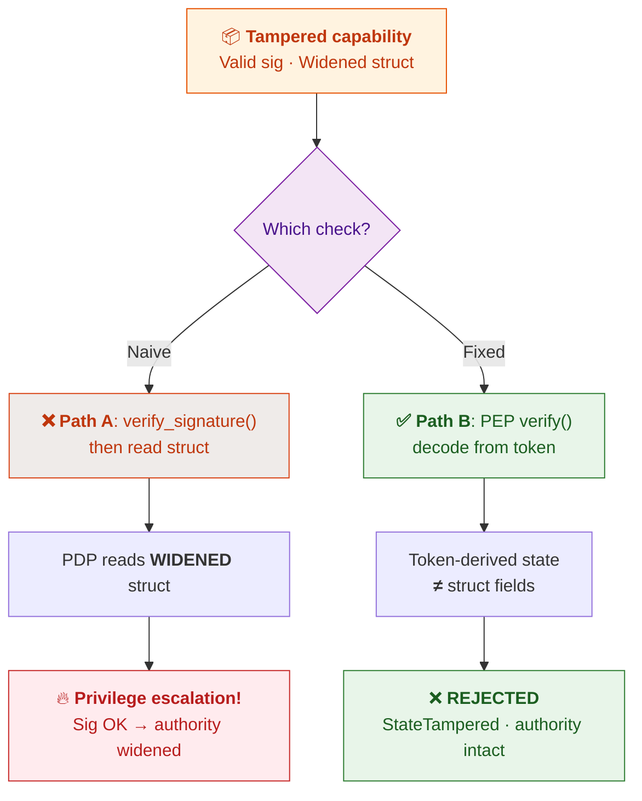



> This is part two of a series on treating AI agents as security principals.
> [Part one: "Prompt Injection Is an Authorization Bug"](https://www.senthilsiva.com/posts/prompt-injection-is-an-authorization-bug/).

If you've ever written code that checks a password, a token, or a signature, you've
been taught a reassuring story:

> **If the signature verifies, you can trust it.**

I believed that story too. Then I built a capability system for AI agents, and
I found a case where the signature verified — and the attacker got more
permissions than they were granted anyway. The crypto did exactly what it was
designed to do. And it didn't matter.

This post is about that bug: how it hides in plain sight, why most developers
would write the vulnerable version on the first try, and the one-line
architectural decision that fixes it. You don't need to be a security engineer
to follow along — if you've ever serialized an object to JSON and read it back,
you already have all the intuition you need.

> **Every code snippet below is real and runnable.** Clone the repo and run
> `cargo run -p warden-pep --example serde_boundary_attack` to watch the attack
> and the defense play out in your terminal.


## The one-minute background

I'm building [a system called Warden](https://github.com/senthil1216/attenuate-agent)
that lets an AI agent touch your filesystem, run commands, and make network
calls — but only within a **capability** that says exactly what it's allowed to
do. Think of a capability like a valet key for a car: it starts the engine, but
it won't open the trunk or the glovebox.

Capabilities have a lovely property: you can **narrow** them, but you can never
**widen** them. If I have a key that opens "every door on floor 3," I can mint
a new key that opens "only room 301" and hand it to someone. But I can *never*
mint a key that opens "every door on floor 4" — I don't have that authority to
give away.

To make this real, every capability is **signed** with cryptography. That way,
when a tool is about to run, it can ask: *"who gave you this key, and did they
actually have the authority to grant it?"*

This is all standard object-capability theory. The interesting part is the bug.

---

## Meet `ChildCapability`

Here's the Rust struct at the heart of the system. I've stripped it down to
the essentials:

```rust
pub struct ChildCapability {
    permissions: PermissionSet,   // ← what is this allowed to do?
    expires_at: DateTime<Utc>,    // ← when does it die?
    token: Vec<u8>,               // ← a signed biscuit token
    root_public_key: Vec<u8>,     // ← who signed it?
}
```

Notice there are **two** things here that both seem to describe the capability's
authority:

1. **`token`** — a blob of bytes, cryptographically signed. Inside those bytes
   live the *real* permissions, the real expiry, and a binding to one specific
   tool call. This is the ground truth. The signature covers it.
2. **`permissions`** — a plain Rust struct. A perfectly normal, in-memory,
   readable, mutable collection of paths and binary names.

Why are there two? Because the token is opaque bytes — great for *verifying*,
annoying for *reading*. When the policy engine wants to ask "is `/repo/src`
writable?", it's much easier to check a struct than to crack open a signed
token. So the struct is a **mirror**: a convenience copy of what's in the token.

Here's the exact comment in the code, which now reads like a warning label:

```rust
/// The authoritative capability state recovered from the cryptographically
/// verified biscuit token — NOT from the in-memory struct fields.
///
/// The plaintext `permissions` field on a `ChildCapability` is a
/// convenience mirror; it is not covered by the signature on its own and
/// must never be the basis of an authorization decision.
```

Read that twice. Then ask yourself the question I should have asked on day one:
**if the struct isn't covered by the signature, what happens if someone changes
it?**

---

## The scenario: crossing the serialization boundary

Here's where it gets real. Capabilities don't live in one process forever.
At some point, you want to:

- Send one over a Unix socket to a worker process
- Store one in a database and load it later
- Pass one between an orchestrator and a tool runner over HTTP

And the universal way we move data between processes is: **serialize it, send
the bytes, deserialize on the other side.** In Rust, that's usually `serde` +
JSON (or bincode, or whatever). It looks like this:

```rust
// Process A
let json = serde_json::to_string(&child_capability)?;
send_over_wire(json);

// Process B
let json = receive_from_wire();
let capability: ChildCapability = serde_json::from_str(&json)?;
```

Now picture this: a capability that was legitimately narrowed to read **only**
`/repo/pkg`, serialized to JSON, and in flight between two processes. Somewhere
on the wire (or in a cache, or in a log, or via an attacker who can tamper
the JSON for one second), the plaintext struct is rewritten:

```json
{
  "permissions": {
    "readable_roots": ["/repo"],          // was ["/repo/pkg"]
    "writable_roots": ["/repo/src"],      // was empty
    "exec_binaries": ["python"]           // was empty
  },
  "token": "AAABBBCCC...",                // untouched
  "root_public_key": "..."                // untouched
}
```

The `token` field — the signed bytes — was never modified. The `permissions`
struct was widened to include read access to the whole repo, write access to
the source tree, and the ability to run Python.

On the other side, the receiving process deserializes this into a
`ChildCapability`. Now what does it do?

---

## The two checks, and the trap

The receiving process needs to answer one question: **"is this capability
authentic?"** And here's the fork in the road that determines whether you're
vulnerable.

Here's the two paths — same tampered capability, opposite outcomes:



### The naive check (what most of us would write)

```rust
// Verify the signature of the token...
capability.verify_signature()?;

// ...then read the permissions from the struct.
let perms = capability.permissions();
pdp.decide(perms, &tool_request)
```

This feels right. It even *is* right about one thing: `verify_signature()`
confirms the token bytes are authentic and unmodified. But it is completely
silent about the `permissions` struct, because **the signature never covered
the struct**.

So what happens? `verify_signature()` returns `Ok(())`. The crypto is
satisfied. Then the policy engine reads `capability.permissions()` — the
*tampered* struct — and sees:

- readable: `["/repo"]` ✓
- writable: `["/repo/src"]` ✓
- exec: `["python"]` ✓

...and authorizes the request. The attacker just gained read/write/exec they
were never granted. **The signature verified. The authority widened anyway.**

This isn't a broken signature algorithm. This isn't a weak key. This is a
silent agreement to trust a field that the cryptography was never asked to
protect.

### The bug in one sentence

> **You signed one representation of the authority, then decided based on a
> different representation of it.**

That's it. That's the whole bug class. And it's incredibly easy to fall into,
because the "mirror struct" pattern is everywhere — it's how we make signed
tokens ergonomic to use.

---

## Why this is harder to spot than it sounds

A few things conspire to hide this bug:

**1. The happy path works perfectly.** If you mint a capability, hold it in
memory, and check it in the same process — the struct and the token always
agree. The bug only appears across a serialization boundary, which might be
the one code path you don't unit-test.

**2. The crypto gives you a warm feeling.** You wrote `verify_signature()`,
it passed, you felt secure. The presence of strong cryptography made it harder
to notice that the crypto was checking the *wrong thing*.

**3. The struct is right there, so convenient.** Of course you'll read from
`capability.permissions()` — it's typed, it's ergonomic, it has nice methods.
Cracking open the signed token to read facts back out is awkward. Convenience
and correctness pulled in opposite directions.

**4. "It's just a mirror" is a lie that compiles.** Nothing in the type system
tells you that `permissions` is a derived/cached value that must not diverge.
It looks like any other field. The constraint lives in a doc comment, and
doc comments don't run at runtime.

---

## The fix: decide from the signed token, and treat the struct as suspect

Here's the mental shift that fixes it:

> **The only thing you may trust is what the signature actually covers.
> Everything else is unverified input.**

In code, that means the policy decision must read from the **token**, not the
struct. Concretely, `verify_and_decode` does two things:

```rust
pub fn verify_and_decode(&self) -> Result<VerifiedState, CapabilityError> {
    // 1. Crack open the signed token and recover the REAL authority.
    let decoded = biscuit_codec::decode_state(&self.token, public_key)?;

    // 2. Defense in depth: if the plaintext mirror disagrees with the
    //    signed token, reject — even if the signature itself is valid.
    if decoded.permissions != self.permissions
        || decoded.expires_at != self.expires_at
        || decoded.request_binding.as_ref() != self.request_binding()
    {
        return Err(CapabilityError::TokenStateMismatch);
    }

    Ok(VerifiedState { /* ...from the token, never the struct... */ })
}
```

And the policy engine is handed a `VerifiedCapability` whose accessors expose
*only* token-derived state. The struct is no longer in the decision path. It
can't widen the authority, because it isn't consulted for the authority.

The regression test that locks this in is the clearest statement of the whole
story:

```rust
#[test]
fn verify_rejects_struct_permissions_widened_after_signing() {
    // Legitimately attenuated: read ONLY /repo/pkg, no write, no exec.
    let child = root.attenuate(attenuation_request(), now).unwrap();

    // Attacker keeps the validly-signed token but widens the struct...
    let mut json = serde_json::to_value(&child).unwrap();
    json["permissions"]["readable_roots"] = json!(["/repo"]);
    json["permissions"]["writable_roots"] = json!(["/repo/src"]);
    json["permissions"]["exec_binaries"] = json!(["python"]);
    let tampered: ChildCapability = serde_json::from_value(json).unwrap();

    // The OLD, vulnerable check — signature only — still passes...
    assert!(tampered.verify_signature().is_ok());

    // ...but the fixed path catches the divergence and rejects.
    assert_eq!(
        verify(tampered, now, None).unwrap_err(),
        VerificationError::StateTampered
    );
}
```

Notice what's asserted twice at the bottom: the *old* check still passes on
the tampered capability (that's the vulnerability, preserved as a
demonstration), and the *new* check catches it. That test is the hero diagram
of this whole post.

---

## The general lesson (this is not about Rust or biscuits)

Step back from the specifics. Here's the pattern, and you'll see it
everywhere once you look for it:

> **Whenever you have two representations of the same authority — one signed
> and one convenient — the convenient one is a loaded footgun.**

You'll find this shape in:

- **JWTs** with a body claim and a separate in-memory "session" struct
- **Macaroons** with caveats and a deserialized scope object
- **TLS client certificates** and a cached "who is this user" struct
- **Database row-level permissions** and an application-layer permission cache
- **Any system where you sign/verify a token but then make a decision from
  a copy**

The fix is always the same shape:

1. Identify which representation the signature actually covers.
2. Make your decision from *that* representation.
3. Treat every other copy as unverified input — useful for display, useless
   for authorization, and worth actively cross-checking so tampering fails
   loud.

The crypto was never wrong. It was just never asked the right question.

---

## What this means for AI agents specifically

If you're building systems where an AI agent touches the real world — files,
shell, network — you are going to build something like a capability system.
You have to; the alternative is asking the model nicely not to do bad things,
which is [the authorization bug I wrote about last time](https://www.senthilsiva.com/posts/prompt-injection-is-an-authorization-bug/).

And the moment you build a capability system, you will face the exact fork in
the road above. You'll have a signed token and a convenient struct. You'll be
tempted to read from the struct. And somewhere — across a serde boundary, an
IPC hop, a cache, a log replay — the struct will diverge from the token, and
your signature will verify while the authority quietly widens.

The good news: the fix is a small, deliberate architectural decision, not a
crypto breakthrough. Decide from the thing you signed. Everything else is
untrusted.

---

## See it in your terminal

If you run `cargo run -p warden-pep --example serde_boundary_attack`, here's
what prints — the attack and the defense, step by step, with no editing:

```
╔════════════════════════════════════════════════════════════╗
║  STEP 1 — Legitimate attenuation                            ║
╚════════════════════════════════════════════════════════════╝
  Root authority:  read /repo, write /repo/src, exec {python}
  Child attenuated: read /repo/pkg ONLY (no write, no exec)

╔════════════════════════════════════════════════════════════╗
║  STEP 2 — Attacker widens the plaintext struct              ║
╚════════════════════════════════════════════════════════════╝
  Token bytes:      UNTOUCHED (the signed blob is intact)
  Struct widened:   read /repo, write /repo/src, exec {python}
  → The struct now claims MORE authority than the token grants.

╔════════════════════════════════════════════════════════════╗
║  STEP 3 — OLD check: verify_signature() only                 ║
╚════════════════════════════════════════════════════════════╝
  ✓ Signature VERIFIES — the token bytes are authentic.

  ⚠️  But the struct field was widened! A downstream PDP reading
     capability.permissions() would see widened authority and
     authorize read/write/exec that was never granted.

     → THE SIGNATURE VERIFIED, THE AUTHORITY WIDENED ANYWAY.

╔════════════════════════════════════════════════════════════╗
║  STEP 4 — FIXED check: verify() via the PEP                  ║
╚════════════════════════════════════════════════════════════╝
  ✗ REJECTED — VerificationError::StateTampered

  The PEP decoded the authoritative state FROM the signed token
  and found it disagrees with the plaintext struct. The widening
  was caught — even though the signature itself is valid.

╔════════════════════════════════════════════════════════════╗
║  STEP 5 — Honest capability (no tampering)                   ║
╚════════════════════════════════════════════════════════════╝
  ✓ verify() passes — struct agrees with token.
  ✓ PDP sees the token-derived (authoritative) state:
     allows_read("/repo/pkg/file")  = true
     allows_read("/repo/other")     = false
     allows_write("/repo/src/x")    = false
```

Step 3 is the vulnerability. Step 4 is the fix. Step 5 is the proof that
honest capabilities still pass — enforcement didn't break the happy path, it
closed the hole.

---

## Appendix: the smell test for your own code

Ask these three questions about any signed/verified-token system you work on:

1. **What exactly is covered by the signature?** (Not "what's in the object" —
   what *bytes* does the signature actually run over?)
2. **What does the authorization decision read from?** Is it the signed thing,
   or a field next to it?
3. **Is there any code path where the two could diverge?** Serialization?
   Caching? A mutable struct field that "should always match"?

If the answer to #3 is ever "yes," you have a latent version of this bug. The
signature will keep verifying. The authority will keep widening. And neither
your tests nor your threat model will catch it — until a tampered struct
crosses a boundary in production.

---

*The code for all of this is [open and commented](https://github.com/senthil1216/attenuate-agent),
including the regression test that fails closed on the exact attack described
above. If you're building agent infrastructure, I'd love to hear how you're
handling the boundary between "what we signed" and "what we decided on."*
